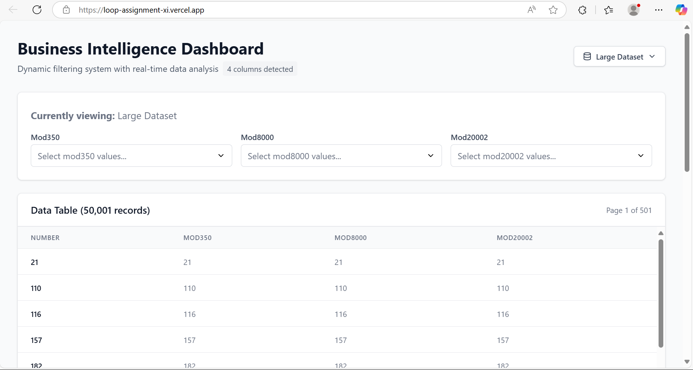
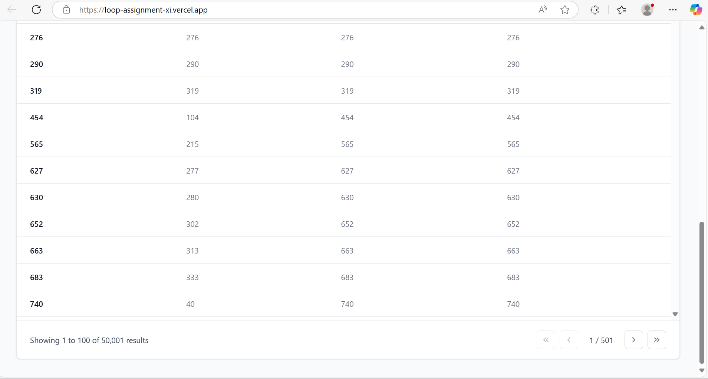
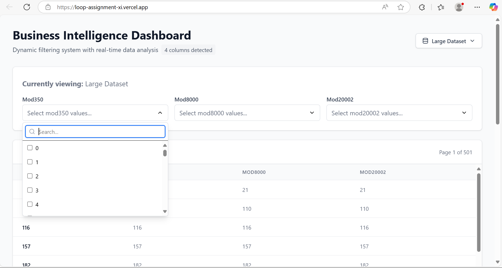
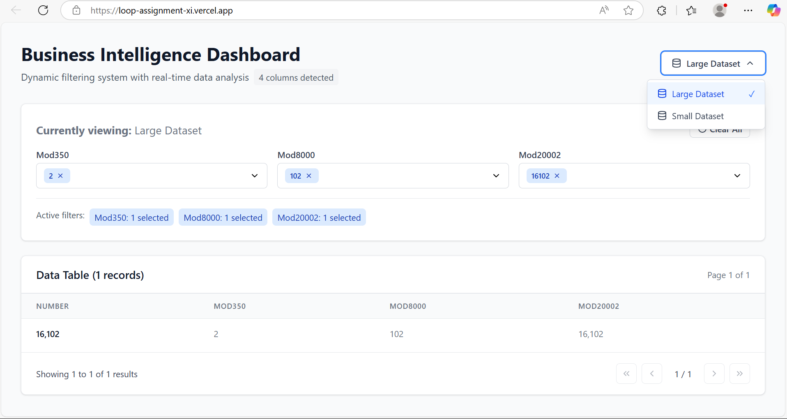

# Loop Assignment

A React + TypeScript + Vite project that demonstrates a **business intelligence dashboard** with advanced filter functionality and a paginated data table, styled using **Tailwind CSS**, and deployed [**here**](https://loop-assignment-xi.vercel.app/) for live preview.

---


## 📚 Contents

- [Functionality Overview](#-functionality-overview)
- [Getting Started](#-getting-started)
- [Usage](#-usage)
- [Project Structure](#-project-structure)
- [Context & Hooks](#-context--hooks)
- [Example Screenshots](#-example-screenshots)
- [Scripts](#-scripts)


---

## ✨ Functionality Overview

### 1. Paginated Data Table

- **Displays tabular data**.
- **Pagination**: 100 rows per page, with controls for first, previous, next, and last page.
- **Scrolling**: Only 20 entries are visible at a time for better performance and usability.
- **Loading and empty states** for a smooth user experience.
- **Handles large datasets** efficiently (tested with 50000+ rows and more).

### 2. Dynamic Multi-Select Filters

- **One filter per column** (e.g., modulo 3, modulo 4, etc.), each supporting multi-select and search.
- **Dropdown UI**: Searchable, multi-select, and responsive.
- **Filter ↔ Table Interaction**: Selecting values in a filter instantly updates the table to show only matching rows.
- **Filter ↔ Filter Interaction**:  
  - When you select values in one filter, all other filters update their dropdown options to only show values relevant to the filtered data.
  - For example, if you select "2" in the "modulo 3" filter, the "modulo 6" filter will only show values that exist in the filtered dataset.
  - The selected filter always shows all possible values, with only the selected ones checked.
- **Overlay closes dropdown** on outside click for better UX.

### 3. Database Switcher

- **Switch between datasets** (e.g., "Small Database", "Large Database") using a dropdown.
- **Loading and disabled states** for smooth transitions.

### 4. Testing

- **Unit tests** for components using [@testing-library/react](https://testing-library.com/docs/react-testing-library/intro/) and [Vitest](https://vitest.dev/).

### 5. Styling

- **Tailwind CSS** for utility-first, responsive, and accessible UI.

---

## 🚀 Getting Started

1. **Install dependencies**
   ```sh
   npm install
   ```

2. **Run the development server**
   ```sh
   npm run dev
   ```

3. **Run tests**
   ```sh
   npm test
   ```

4. **Build for production**
   ```sh
   npm run build
   ```

---

## 🛠 Usage

- On launch, the app displays a data table with pagination and filter dropdowns above each column.
- **To filter data:**  
  Use the dropdowns to select one or more values for any column. The table and other filters update instantly to reflect your selection.
- **To switch datasets:**  
  Use the database switcher dropdown to load a different dataset (e.g., small or large).
- **Pagination controls** allow navigation through data pages.

---

## 🗂 Project Structure

- `src/components/data-table.tsx`  
  Paginated table component with all logic and UI.
- `src/components/filter-dropdown.tsx`  
  Multi-select, searchable filter dropdown for each column.
- `src/components/database-switcher.tsx`  
  Dropdown component to switch between datasets.
- `src/context/`  
  Contains React Context providers for global state management.
- `src/hooks/`  
  Custom React hooks for filtering, pagination, and dropdown logic.
- `src/test/components/`  
  Unit tests for components.
- `src/main.tsx`  
  App entry point.
- `src/index.css`  
  Tailwind CSS import.

---

## 📸 Example Screenshots

- **Table with Pagination:**  
  
  
- **Filter Dropdown:**  
  
- **Database Switcher Dropdown:**  
  

---

## 📦 Scripts

- `npm run dev` – Start development server
- `npm run build` – Build for production
- `npm run preview` – Preview production build
- `npm run lint` – Lint code
- `npm test` – Run tests

---

